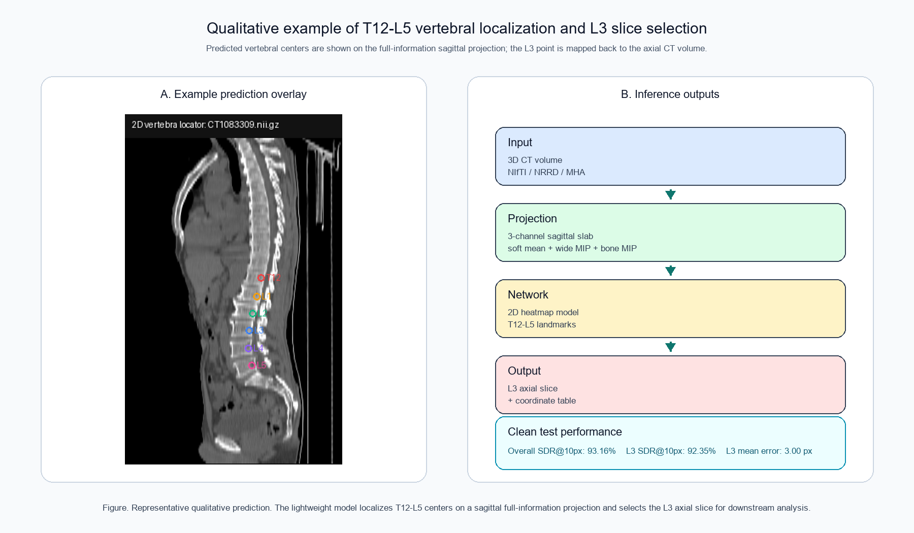

# 轻量化 2D 全信息矢状位椎体定位模型

本项目提供一个轻量化 2D 椎体中心点定位模型，可从 3D CT 体数据中自动定位 T12-L5 椎体中心，并输出 L3 层面对应的轴位单层 CT 图像。该模型主要用于 L3 层面自动选择，以衔接后续体成分分析。

## 项目特点

- 输入：3D CT 体数据，例如 `.nii.gz`、`.nii`、`.nrrd`、`.mha`。
- 输出：T12-L5 椎体中心点坐标、矢状位定位预览图、L3 单层轴位影像。
- 模型：轻量化 2D U-Net 风格热图定位网络。
- 输入方式：3 通道全信息矢状位 slab 投影。
- clean test 性能：总体 SDR@10px 为 `93.16%`，L3 SDR@10px 为 `92.35%`。

## 目录结构

```text
model/
  best_model.pt
src/
  vertebra_locator.py
results/
  training_summary.json
  training_history.json
  performance_sdr_v21_clean.json
  excluded_cases_v21.json
figures/
  figure_1_workflow.png
  figure_2_training_curves.png
  figure_3_sdr_by_vertebra.png
docs/
  methods_and_performance.md
examples/
  example_prediction_preview.png
```

## 环境安装

```bash
pip install -r requirements.txt
```

PyTorch 请根据本机 CUDA 或 CPU 环境安装对应版本。

## 使用方法

```bash
python src/vertebra_locator.py \
  --input /path/to/ct_volume.nii.gz \
  --output-dir outputs/case001 \
  --device cuda:0 \
  --slice-format nrrd
```

输出包括：

- `vertebra_locations.json`
- `vertebra_locations.csv`
- `vertebra_locator_preview.png`
- `l3_single_slice.nrrd` 或 `l3_single_slice.nii.gz`

## 性能结果

clean test 集：

| 指标 | 数值 |
| --- | ---: |
| 测试病例数 | 183 |
| 椎体中心点数 | 1,097 |
| 平均误差 | 2.85 px |
| 中位误差 | 1.00 px |
| SDR@5px | 92.07% |
| SDR@10px | 93.16% |
| SDR@15px | 93.80% |
| SDR@20px | 94.53% |

L3 单独性能：

| 指标 | 数值 |
| --- | ---: |
| 平均误差 | 3.00 px |
| 中位误差 | 1.00 px |
| SDR@5px | 91.26% |
| SDR@10px | 92.35% |
| SDR@15px | 93.44% |
| SDR@20px | 93.99% |

更完整的方法和结果描述见 [`docs/methods_and_performance.md`](docs/methods_and_performance.md)。

## 样本预测示意图



## 注意

本项目用于学术研究和方法复现，尚未作为医疗器械注册或审批，不应用于未经验证的临床诊断决策。

## 许可证

本项目采用分层许可证：

- 代码：Apache License 2.0
- `model/` 下的模型权重：CC BY-NC 4.0，仅限非商业科研和教学用途
- 文档、图表和结果摘要：CC BY 4.0

未经版权方明确书面许可，不允许将模型权重用于商业用途、临床产品集成或医疗器械注册/部署。
